# **M5Stack Notes**

This repository documents a detailed exploration of the M5Stack hardware ecosystem, focusing on building small interactive devices that combine motion sensing, audio playback, LEDs, haptics, RFID, and ultra-low-power operation.

The research compares different families of M5Stack devices, evaluates their expandability, and maps out which modules, batteries, and accessories are compatible with each hardware form factor.

Device and accessory reference tables are included below.

## 1. Overview

M5Stack provides a diverse range of ESP32-based development devices organised into several hardware families:

* **Core series (classic 5×5 cm)** — modular stackable controllers
* **CoreS3 series (new generation)** — advanced multimedia controllers
* **Stick series** — compact wearable-style devices
* **ATOM series** — ultra-small modular cubes
* **STAMP modules** — embedded boards for custom wiring

Each family has unique strengths and constraints, especially regarding audio, IMU functionality, battery integration, module compatibility, and power management.

## 2. Device Family Comparison

### **CoreS3 Series**

Advanced multimedia devices with touchscreens, dual microphones, camera, IMU, and (on CoreS3) a magnetometer. Uses a new 30-pin base connector and does not support classic stack modules.

### **Classic Core Series (Core, Core2, Fire, AWS EduKit, M5GO kits)**

Designed around the 57×57 mm, 12-pin M-Bus form factor. Support stackable modules including:

* Battery modules
* Relay modules
* Audio Module (STM32G030)
* M5GO Bottom bases with 10 RGB LEDs

### **Stick Series**

Small rectangular devices with integrated battery, IMU, small LCD, and optional Hats (speaker, sensors, buttons). The PLUS2 model adds a vibration motor and improved PMIC.

### **ATOM Series**

Ultra-small cubes featuring minimal ESP32 boards, often with add-ons:

* **Matrix**: 25 NeoPixels + IMU
* **Echo**: speaker + microphone
* **Lite**: minimal I/O
* Use via Grove connectors or direct wiring.

## 3. Understanding Module Stacking

Classic stack modules (battery, audio, relay, proto, etc.) only attach to:

* Core (Original)
* Core2
* Core Fire
* M5GO
* Core2 AWS EduKit

CoreS3 does not use the classic M-Bus; Stick and ATOM devices rely on Grove and wiring instead of stacking.

Selecting hardware requires understanding this difference, especially when combining power modules or expansion modules.

## 4. Motion Sensing

### **IMU (6-axis and 9-axis)**

Many M5Stack devices include inertial measurement units (IMUs) that provide accelerometer and gyroscope data. Devices with IMU capabilities include:

* **ATOM Matrix** (IMU)
* **StickC PLUS2** (IMU)
* **CoreS3** (IMU)
* **Core2** (IMU)
* **Core Fire** (IMU)
* **M5GO** (IMU)

These sensors enable motion detection, orientation tracking, shake detection, and gesture recognition.

### **Magnetometer Availability**

Only a few devices include a magnetometer:

* **CoreS3**
* **Core Fire**

Devices based on the MPU6886 (Stick series, ATOM Matrix, etc.) include only accelerometer + gyroscope.

Magnetometers enable compass features, orientation-corrected sensor fusion, and magnetic field detection.

## 5. Adding Sound Capabilities

Many M5Stack boards lack onboard speakers. To play audio, consider:

* **StickC PLUS2 + Speaker Hat (MAX98357)**
* **ATOM Echo**
* **CoreS3** (built-in full I²S audio subsystem)
* **MAX98357 I²S amplifier modules** wired to ATOM or Stick devices
* **Audio Module (STM32G030)** for *classic Core* stackable devices

Short WAV/MP3 audio playback is feasible across the entire ecosystem when an appropriate amplifier is present.

## 6. LEDs and NeoPixel Effects

RGB LED capabilities vary by device:

* **ATOM Matrix** offers a 25-pixel NeoPixel matrix
* **Core Fire**, **M5GO**, **Core2 AWS EduKit** include 10-pixel LED bars in their M5GO bottoms
* **StickC PLUS2**, **ATOM Lite**, **ATOM Echo** each include a single RGB LED
* **CoreS3** has no onboard NeoPixels but works with M5GO Bottom3

These can be used for icons, animations, interaction cues, and visual feedback.

## 7. Haptic Feedback

To add vibration feedback, consider devices with built-in motors:

* **Core2**
* **M5StickC PLUS2**

Other boards require wiring a coin-cell vibration motor.

## 8. RFID Interaction

RFID support is not built into any M5Stack Core or ATOM device. Use the **RFID Unit 2 (WS1850S)** over Grove (I²C/UART).

Compatible with:

* Core / Core2 / Fire
* CoreS3
* Stick series
* ATOM series

This enables actions such as sound or LED effects triggered by specific tags.

## 9. Ultra-Low-Power Behaviour and RTC-Based Wake-Up

To create devices that run for long periods and only wake occasionally, true **power gating** is required — not just ESP32 deep sleep.

The **M5Stamp Timer Power (BM8563)** enables:

* RTC alarms
* timed wake-ups
* fully powering the ESP32 board off (microamp consumption)
* timed reactivation

It requires manual wiring and is independent of M5Stack form factors, making it ideal for embedded low-power projects.

## 10. Mounting and LEGO Integration

Physical construction can be supported using:

* **SandwichC Bricks** (LEGO-compatible mounting plates)
* **M3 screw kits**
* **M5 Box** for storage and prototyping

These allow embedding M5Stack hardware into toys, enclosures, and kinetic experiments.

## 11. Building Interactive Devices

### **Motion-Reactive Devices**

To build compact interactive devices (e.g., "cubes") that respond to shaking, rotation, or tapping, pair:

* a device with a **6-axis or 9-axis IMU**
* either a **built-in speaker** or an **I²S audio amplifier**
* optional **RGB LEDs** for visual effects
* a **small battery base** (e.g., Atomic Battery Base or TailBat)

Useful hardware options include:

* **ATOM Matrix** (25 NeoPixels, IMU)
* **StickC PLUS2** (IMU, vibration motor, small display)
* **ATOM Echo** (speaker onboard, needs external IMU)
* **CoreS3** (more advanced but larger)

These devices can play short sounds when moved, light up LEDs, vibrate, or react to orientation.

### **Educational and Toy Interaction Patterns**

The research identifies several patterns for building interactive devices:

* shake-to-sound cubes
* direction-aware toys using magnetometers
* RFID-triggered responses
* sound/light objects embedded in LEGO structures
* wearable sound/noise devices
* low-power IoT nodes waking briefly to perform tasks
* touchscreen audio-visual gadgets using CoreS3

These patterns benefit from selecting the right combination of IMU, speaker, LEDs, and power hardware.

## 12. Curated Hardware Set (as used in this project)

The following devices and modules form a versatile experimental toolkit:

* **CoreS3**
* **M5StickC PLUS2** + Speaker Hat
* **ATOM Matrix**
* **M5Stamp Timer Power** (RTC power gating)
* **RFID Unit 2**
* **Atomic Battery Base**
* **Mini Dual Button Unit**
* **SandwichC Bricks**
* **M3 Screw Kit**

This selection enables building portable sound toys, motion-reactive cubes, RFID-aware devices, and long-life low-power systems.

## 13. Reference Tables

Device and accessory reference tables have been placed below.

These tables include detailed information on:

* footprints
* battery types
* IMU and magnetometer
* audio capabilities
* LED systems
* vibration motors
* camera and microphones
* RTC presence
* module compatibility
* whether an item is in the current hardware basket

### 📦   DEVICE TABLE

|   Device             | Family       | 12-pin M-Bus | IMU | Mag | Display    | Speaker | Battery | SD | Vib | Camera | Mics   | RTC | Extra LEDs        | Where the pixels live        | PiHut Link |
| -------------------- | ------------ | ------------ | --- | --- | ---------- | ------- | ------- | -- | --- | ------ | ------ | --- | ----------------- | ---------------------------- | ---------- |
|   CoreS3             | Core (new)   | ✘            | ✔   | ✔   | 2.0" touch | ✔       | ✔       | ✔  | ✘   | ✔      | ✔ dual | ✔   | 0                 | None (unless adding Bottom3) | [Search](https://thepihut.com/search?q=M5Stack%20CoreS3) |
| CoreS3 SE            | Core (new)   | ✘            | ✘   | ✘   | 2.0" touch | ✔       | ✘       | ✔  | ✘   | ✔      | ✔ dual | ✔   | 0                 | None                         | [Search](https://thepihut.com/search?q=M5Stack%20CoreS3%20SE) |
| Core (Original)      | Core classic | ✔            | ✘   | ✘   | 2.0" LCD   | ✔       | ✘       | ✔  | ✘   | ✘      | ✘      | ✔   | 0                 | None                         | [Search](https://thepihut.com/search?q=M5Stack%20Core) |
| Core2                | Core classic | ✔            | ✔   | ✘   | 2.0" touch | ✔       | ✔       | ✔  | ✔   | ✘      | ✔      | ✔   | 0 (10 w/ Bottom2) | LEDs in Bottom2 only         | [Search](https://thepihut.com/search?q=M5Stack%20Core2) |
| Core Fire            | Core classic | ✔            | ✔   | ✔   | 2.0" LCD   | ✔       | ✔       | ✔  | ✘   | ✘      | ✘      | ✔   |   10 SK6812       | In M5GO base                 | [Search](https://thepihut.com/search?q=M5Stack%20Core%20Fire) |
| M5GO (Core kit)      | Core classic | ✔            | ✔   | ✘   | 2.0" IPS   | ✔       | ✔       | ✘  | ✘   | ✘      | ✔      | ✔   |   10 LEDs         | In M5GO base                 | [Search](https://thepihut.com/search?q=M5Stack%20M5GO) |
|   Core2 AWS EduKit   | Core classic | ✔            | ✔   | ✘   | 2.0" touch | ✔       | ✔       | ✔  | ✔   | ✘      | ✔      | ✔   |   10 LEDs         | In M5GO Bottom2              | [Search](https://thepihut.com/search?q=M5Stack%20Core2%20AWS%20EduKit) |
| M5StickC PLUS        | Stick        | ✘            | ✔   | ✘   | Small TFT  | Buzzer  | ✔       | ✘  | ✘   | ✘      | ✔      | ✔   | 0                 | None                         | [Search](https://thepihut.com/search?q=M5StickC%20PLUS) |
|   M5StickC PLUS2     | Stick        | ✘            | ✔   | ✘   | IPS TFT    | Buzzer  | ✔       | ✘  | ✔   | ✘      | ✔      | ✔   |   1 RGB           | On StickC PLUS2 main board   | [Search](https://thepihut.com/search?q=M5StickC%20PLUS2) |
|   ATOM Matrix        | ATOM         | ✘            | ✔   | ✘   | 5×5 LEDs   | ✘       | ✘       | ✘  | ✘   | ✘      | ✘      | ✘   |   25 WS2812       | On front LED matrix          | [Search](https://thepihut.com/search?q=M5Stack%20ATOM%20Matrix) |
| ATOM Lite            | ATOM         | ✘            | ✘   | ✘   | None       | ✘       | ✘       | ✘  | ✘   | ✘      | ✘      | ✘   |   1 RGB           | On main board                | [Search](https://thepihut.com/search?q=M5Stack%20ATOM%20Lite) |
| ATOM Echo            | ATOM         | ✘            | ✘   | ✘   | None       | ✔       | ✘       | ✘  | ✘   | ✘      | ✔      | ✘   |   1 RGB           | On main board                | [Search](https://thepihut.com/search?q=M5Stack%20ATOM%20Echo) |

### 🔌   ACCESSORIES TABLE

| Accessory                               | What it does             | Footprint compatibility             | Where used                     | PiHut Link |
| --------------------------------------- | ------------------------ | ----------------------------------- | ------------------------------ | ---------- |
|   M5Stamp Timer Power                   | RTC + timed power gating | Universal (wired)                   | Ultra-low-power / wake control | [Search](https://thepihut.com/search?q=M5Stamp%20Timer%20Power) |
|   M5StickC PLUS Speaker Hat (MAX98357)   | Adds digital speaker     | Stick family                        | Audio output                   | [Search](https://thepihut.com/search?q=M5StickC%20Speaker%20Hat) |
|   Atomic Battery Base                   | 200 mAh battery          | ATOM footprint                      | Portable ATOM builds           | [Search](https://thepihut.com/search?q=Atomic%20Battery%20Base) |
|   SandwichC Brick (x3)                  | Lego-compatible adapter  | Universal mechanical                | Mounting                       | [Search](https://thepihut.com/search?q=SandwichC%20Brick) |
|   RFID Unit 2 (WS1850S)                 | RFID reader              | Any Grove-enabled device            | NFC-like reading               | [Search](https://thepihut.com/search?q=RFID%20Unit%202) |
|   M5 Box                                | Storage                  | Universal                           | Storage                        | [Search](https://thepihut.com/search?q=M5%20Box) |
|   M3 Screw Kit                          | Mounting hardware        | Universal                           | Assembly                       | [Search](https://thepihut.com/search?q=M3%20Screw%20Kit) |
|   Mini Dual Button Unit                 | 2-button Grove input     | Universal                           | Input device                   | [Search](https://thepihut.com/search?q=Mini%20Dual%20Button%20Unit) |
| Audio Module (STM32G030)                | Stereo codec             | Classic Core stack                  | External audio                 | [Search](https://thepihut.com/search?q=M5Stack%20Audio%20Module) |
| Core Battery Modules (13.2 etc.)        | Extra battery            | Classic 5×5                         | Stackable                      | [Search](https://thepihut.com/search?q=M5Stack%20Battery%20Module) |
| M5GO bottom (RGB)                       | LED bar + battery        | Core2 / Core Fire / CoreS3 versions | Adds 10 LEDs                   | [Search](https://thepihut.com/search?q=M5GO%20Bottom) |
| TailBat                                 | Battery                  | ATOM                                | Portable                       | [Search](https://thepihut.com/search?q=TailBat) |
| M5StickC 18650 Base                    | 18650 battery holder    | Stick family                        | Extended runtime for StickC   | [Product](https://thepihut.com/products/m5stickc-18650) |
| M5Stack Base AAA Battery Holder        | AAA battery holder       | Classic Core stack                  | Alternative power for Core   | [Product](https://thepihut.com/products/m5stack-base-aaa-battery-holder) |
| Generic I²S amp                         | Speaker amp              | Any wired                           | External audio                 | [Search](https://thepihut.com/search?q=I2S%20amplifier) |

# Diagrams

## Classic Core Series (5×5 cm, 12-pin M-Bus)

```mermaid
flowchart TD
    note1["ClassicCore<br/>• 57×57 mm footprint<br/>• 12-pin M-Bus on bottom<br/>• Compatible with stack modules:<br/>  – Battery modules<br/>  – Audio Module (STM32G030)<br/>  – Relay / IO modules<br/>• Good for modular, stackable builds"]

    subgraph ClassicCore["Classic Core Series (5×5 cm, 12-pin M-Bus)"]
        C0["Core (Gray)<br/>• 57×57 mm classic Core<br/>• ESP32<br/>• 12-pin M-Bus stack<br/>• LCD, speaker, SD<br/>• No IMU / no magnetometer"]
        C1["Core2<br/>• 57×57 mm classic Core<br/>• Touchscreen, speaker<br/>• Battery, SD<br/>• 6-axis IMU (no mag)<br/>• Vibration motor<br/>• 12-pin M-Bus stack"]
        C2["Core Fire<br/>• Classic Core + IMU<br/>• 9-axis (MPU9250 with mag)<br/>• 10 RGB LEDs in M5GO base<br/>• Battery, SD, speaker<br/>• 12-pin M-Bus stack"]
        C3["Core2 AWS EduKit<br/>• Core2 + M5GO Bottom2<br/>• 10 RGB LEDs in base<br/>• Battery, SD, speaker<br/>• 6-axis IMU (no mag)<br/>• 12-pin M-Bus stack"]
        C4["M5GO (Core kit)<br/>• Core-style controller<br/>• 6-axis IMU<br/>• 10 RGB LEDs in M5GO base<br/>• Battery, speaker, mic<br/>• 12-pin M-Bus stack"]
    end

    
note1 -.->   C0  
note1 -.->   C1  
note1 -.->   C2  
note1 -.->   C3  
note1 -.->   C4  
```

---

## CoreS3 Series (new 30-pin bus)

```mermaid
flowchart TD
    noteS3["CoreS3Series<br/>• Use a new 30-pin base connector<br/>• NOT compatible with classic 5×5 stack modules<br/>• Can use S3-specific bottoms (e.g. M5GO Bottom3) for:<br/>  – Extra battery<br/>  – 10 RGB LEDs<br/>• Best suited for rich UI, audio, camera, and sensing"]

    subgraph CoreS3Series["CoreS3 Series (New 30-pin Base Connector)"]
        S3["CoreS3<br/>• 54×54 mm S3 footprint<br/>• Touchscreen + camera<br/>• Dual microphones<br/>• 6-axis IMU + magnetometer<br/>• 500 mAh internal battery<br/>• SD card<br/>• No 12-pin M-Bus"]
        S3SE["CoreS3 SE<br/>• Same footprint as CoreS3<br/>• Touchscreen, camera, dual mics<br/>• No IMU / no magnetometer<br/>• No internal battery<br/>• SD card<br/>• No 12-pin M-Bus"]
    end

    
noteS3 -.->   S3  
noteS3 -.->   S3SE  
```

---

## Stick Series (wearable / slim devices)

```mermaid
flowchart TD
    noteST["StickSeries<br/>• Designed for wearable / handheld projects<br/>• Expansion via Stick Hat connector + Grove<br/>• Good for:<br/>  – Small UI devices<br/>  – Wrist-worn or pocket tools<br/>  – Motion + sound toys with Speaker Hat"]

    subgraph StickSeries["Stick Series (Wearable / Slim Devices)"]
        ST1["M5StickC PLUS<br/>• Slim stick form factor<br/>• 6-axis IMU (MPU6886)<br/>• Small TFT display<br/>• Internal LiPo battery<br/>• Microphone<br/>• No vibration motor<br/>• No 12-pin M-Bus<br/>• Uses Hat accessories (e.g. Speaker Hat)"]
        ST2["M5StickC PLUS2<br/>• Updated StickC platform<br/>• 6-axis IMU (MPU6886)<br/>• Small IPS TFT<br/>• 200 mAh battery<br/>• Microphone<br/>• Vibration motor<br/>• Single RGB LED<br/>• No 12-pin M-Bus<br/>• Uses Stick Hats (e.g. MAX98357 speaker)"]
    end

    
noteST -.->   ST1  
noteST -.->   ST2  
```

---

## ATOM Series (tiny 24×24 mm cubes)

```mermaid
flowchart TD
    noteAtom["AtomSeries<br/>• No stacking; no 12-pin M-Bus<br/>• Use Grove ports or direct wiring<br/>• Optional Atomic Battery Base for portable builds<br/>• Well suited for:<br/>  – Tiny sound cubes (Echo)<br/>  – Motion + LED cubes (Matrix)<br/>  – Minimal IoT nodes (Lite)"]

    subgraph AtomSeries["ATOM Series (Tiny 24×24 mm Cubes)"]
        A_Lite["ATOM Lite<br/>• Minimal ESP32 dev board<br/>• Single RGB LED<br/>• No IMU<br/>• No speaker<br/>• No battery<br/>• Power via USB or Atomic base<br/>• Expansion via Grove / wiring"]
        A_Matrix["ATOM Matrix<br/>• 24×24 mm cube<br/>• 5×5 RGB LED matrix (25 pixels)<br/>• 6-axis IMU (MPU6886)<br/>• No speaker built-in<br/>• No battery (pair with Atomic Battery Base)<br/>• Grove + GPIO for expansion"]
        A_Echo["ATOM Echo<br/>• 24×24 mm cube<br/>• Built-in speaker<br/>• Microphone<br/>• Single RGB LED<br/>• No IMU<br/>• No battery (optional external base)<br/>• Grove + wiring for sensors"]
    end

    
noteAtom -.->   A_Lite  
noteAtom -.->   A_Matrix  
noteAtom -.->   A_Echo  
```

---

## STAMP / Power Modules (embedded / wired)

```mermaid
flowchart TD
    noteTP["StampSeries<br/>• Not stackable; requires soldering/wiring<br/>• Works with any ESP32 device (Core, Stick, ATOM, etc.)<br/>• Used to:<br/>  – Cut power completely between wake events<br/>  – Achieve ultra-low-power operation<br/>  – Schedule timed wakeups"]

    subgraph StampSeries["STAMP / Power Modules (Embedded / Wired)"]
        STP["M5Stamp Timer Power (BM8563)<br/>• RTC + alarm<br/>• Li-ion charging<br/>• 3.3 V / 5 V output<br/>• Power gating of main board<br/>• Very low standby current<br/>• Small 20×20 mm module"]
    end

    
noteTP -.->   STP  
```

## Power Options and Battery Solutions

```mermaid
flowchart TD
    subgraph InternalPower["On-board / Integrated Power"]
        IP1["CoreS3<br/>• 500 mAh internal LiPo<br/>• Can be extended with S3 Bottom3"]
        IP2["Core2 / Core Fire / M5GO / Core2 AWS<br/>• Internal battery in Core or base<br/>• Capacity depends on kit"]
        IP3["M5StickC PLUS / PLUS2<br/>• Small internal LiPo<br/>• USB-C charging"]
        IP4["Most ATOM devices<br/>• No internal battery<br/>• USB power by default"]
    end

    subgraph StackableBattery["Stackable Battery Modules (Classic 5×5 only)"]
        SB1["Battery Module (Core)<br/>• 5×5 cm stack module<br/>• Extra capacity<br/>• Compatible with Core/Core2/Fire/M5GO/AWS"]
        SB2["High-capacity Battery13.2<br/>• Large stack battery<br/>• For long runtime<br/>• Increases stack height"]
        SB3["M5GO Bottom / Bottom2<br/>• RGB bar + battery + ports<br/>• Kit-specific for Core/Core2/Fire/AWS"]
        SB4["Base AAA Battery Holder<br/>• AAA battery holder<br/>• Alternative power for Core<br/>• Classic 5×5 stack"]
    end

    subgraph AtomBattery["ATOM Battery Options"]
        AB1["Atomic Battery Base (TailBat)<br/>• ~200 mAh LiPo<br/>• Clips to ATOM footprint<br/>• USB-C charging"]
    end

    subgraph StickBattery["Stick Battery Options"]
        STB1["M5StickC 18650 Base<br/>• 18650 battery holder<br/>• Extended runtime for StickC<br/>• Larger capacity than internal LiPo"]
    end

    subgraph ExternalPower["External Power (Universal)"]
        EP1["USB Power Bank<br/>• Plug into USB-C<br/>• Works with all devices"]
        EP2["Bench Supply / Adapter<br/>• 5 V / 3.3 V regulated<br/>• For lab setups"]
    end

    subgraph PowerControl["Power Control / RTC"]
        PC1["M5Stamp Timer Power (BM8563)<br/>• Li-ion charging<br/>• 3.3/5 V output<br/>• RTC alarms<br/>• Full power gating"]
    end

    %% Relationships

    IP1 --> EP1
    IP2 --> EP1
    IP3 --> EP1
    IP4 --> EP1

    SB1 --> IP2
    SB2 --> IP2
    SB3 --> IP2
    SB4 --> IP2

    AB1 --> IP4

    STB1 --> IP3

    PC1 --> IP4
    PC1 --> IP3
    PC1 --> IP2
    PC1 --> IP1
```

**Legend:**
* **InternalPower**: built-in batteries
* **StackableBattery**: classic 5×5 only (includes AAA holder)
* **AtomBattery**: TailBat/Atomic Base for ATOM
* **StickBattery**: 18650 base for StickC
* **ExternalPower**: USB/bulk power
* **PowerControl**: M5Stamp Timer Power for ultra-low-power designs

## Recommended Build Patterns and Device Combinations

```mermaid
flowchart TD
    note_P1["P1: Motion + LED Cube<br/>• Focus on IMU + LEDs, optional battery<br/>• Typical combo: ATOM Matrix + Atomic Battery Base"]
    note_P2["P2: Sound Cube / Toy<br/>• Short WAV/MP3 sounds<br/>• I²S speaker or built-in speaker<br/>• Motion triggers or button triggers"]
    note_P3["P3: RFID Toy<br/>• Use RFID Unit 2 via Grove<br/>• Map tags → sounds, animations, or state changes"]
    note_P4["P4: Ultra–Low-Power Node<br/>• M5Stamp Timer Power controls power<br/>• Device runs briefly, then fully powers down"]
    note_P5["P5: Touchscreen Multimedia Device<br/>• CoreS3 with audio, cam, IMU, mic<br/>• Suitable for rich UI experiments"]

    %% Build patterns
    subgraph Patterns["Recommended Build Patterns"]
        P1["Motion + LED Cube<br/>(e.g. roll/shake to animate)"]
        P2["Sound Cube / Sound Toy<br/>(e.g. short sounds on shake or tap)"]
        P3["RFID Toy / Token Reader<br/>(e.g. tag → sound/light)"]
        P4["Ultra–Low-Power Node<br/>(e.g. wake occasionally, then power off)"]
        P5["Touchscreen Multimedia Device<br/>(audio, graphics, camera)"]
    end

    %% Devices and key modules
    subgraph Devices["Devices"]
        D_CoreS3["CoreS3<br/>• Touch + cam + mic<br/>• Speaker + IMU + mag<br/>• Battery"]
        D_StickP2["M5StickC PLUS2<br/>• IMU + TFT<br/>• Battery + vib + mic"]
        D_AtomMatrix["ATOM Matrix<br/>• 5×5 RGB<br/>• IMU"]
        D_AtomEcho["ATOM Echo<br/>• Speaker + mic<br/>• Single RGB"]
        D_Timer["M5Stamp Timer Power<br/>• RTC + power gating"]
        D_RFID["RFID Unit 2<br/>• Grove RFID reader"]
        D_AAtomic["Atomic Battery Base<br/>• Battery for ATOM"]
        D_SpkHat["StickC Speaker 2 Hat<br/>• MAX98357 I²S speaker"]
        D_Buttons["Mini Dual Button Unit"]
    end

    %% Pattern connections

    %% P1: Motion + LED cube
    P1 --> D_AtomMatrix
    P1 --> D_AAtomic

    %% P2: Sound cube/toy
    P2 --> D_AtomMatrix
    P2 --> D_AtomEcho
    P2 --> D_AAtomic
    P2 --> D_StickP2
    P2 --> D_SpkHat

    %% P3: RFID toy
    P3 --> D_CoreS3
    P3 --> D_StickP2
    P3 --> D_AtomMatrix
    P3 --> D_RFID
    P3 --> D_Buttons

    %% P4: Ultra–low-power node
    P4 --> D_Timer
    P4 --> D_AtomMatrix
    P4 --> D_AtomEcho
    P4 --> D_StickP2
    P4 --> D_CoreS3

    %% P5: Touchscreen multimedia device
    P5 --> D_CoreS3

    %% Notes connections
    note_P1 -.-> P1
    note_P2 -.-> P2
    note_P3 -.-> P3
    note_P4 -.-> P4
    note_P5 -.-> P5
```

---

# Acknowledgements

Generated with help from LLMs (ChatGPT, Claude, Gemini, Cursor).
